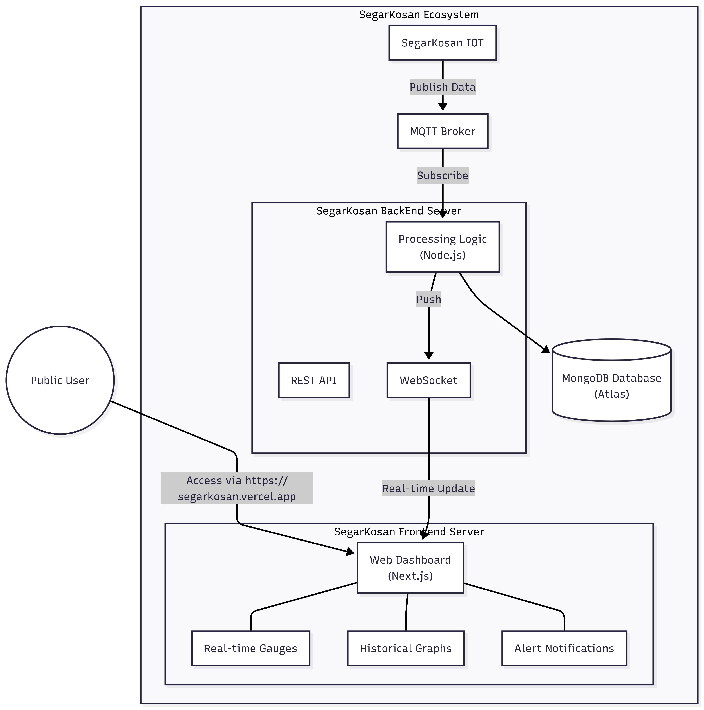

<br />
<div align="center">
  <a href="https://github.com/SegarKosan">
    
  </a>
  <h2 align="center">SegarKosan</h2>

  <p align="center">
    Real-time indoor air quality monitoring system for student boarding rooms
    <br />
    <br />
    <a href="https://github.com/SegarKosan/.github/profile/ABOUT-US.MD">About Us</a>
    &middot;
    <a href="{insert imuii link}">Vote Project Now</a>
    <br />
    <br />
    <a href="https://segarkosan.vercel.app">
      
    </a>
  </p>
</div>

---

## Overview

**SegarKosan** is an IoT-based air quality monitoring system designed for student boarding rooms (kos-kosan). It monitors environmental parameters and provides real-time feedback through a web dashboard.

### Repository Structure

```
SegarKosan/            # ESP32-C3 firmware (PlatformIO)
SegarKosan-BackEnd/    # Node.js MQTT → WebSocket bridge + JWT auth
SegarKosan-FrontEnd/   # Next.js dashboard
```

### What It Measures

| Parameter | Unit | Sensor |
|-----------|------|--------|
| Temperature | °C | DHT22 |
| Humidity | % | DHT22 |
| Heat Index | °C | Calculated |
| CO₂ Level | ppm | MQ-135 |
| Odor Score | 0-100 | Weighted algorithm |

## Features

- **Real-time Monitoring**: Sensor readings every ~5 seconds
- **Odor Score Algorithm**: Weighted calculation from CO₂ (40%), temperature deviation (20%), humidity (20%), and raw sensor (20%)
- **WiFi Provisioning**: Captive portal via WiFiManager for easy setup
- **MQTT Publishing**: Publishes sensor data to configurable broker
- **JWT Authentication**: Secured WebSocket connections
- **PWA Dashboard**: Installable web app with real-time gauges
- **OLED Display**: 5-page rotating display on device

## Hardware

| Component | Model | Pin |
|-----------|-------|-----|
| Microcontroller | ESP32-C3 DevKitC-02 | — |
| Temp/Humidity | DHT22 (AM2302) | GPIO 4 |
| Gas Sensor | MQ-135 | GPIO 2 (ADC) |
| Display | SH1106 OLED 128×64 | I2C: SCL→GPIO8, SDA→GPIO10 |
| Power | USB-C 5V | — |

> ⚠️ MQ-135 requires 5V power. Connect to VIN, not 3.3V.

## System Architecture

### Ecosystem Overview


### IoT Device Architecture


## Data Flow

**MQTT Payload** (published every ~5s to `segar_kosan/sensors`):
```json
{
  "type": "sensor",
  "device_id": "ESP32-C3",
  "payload": {
    "temperature": 28.5,
    "humidity": 65.2,
    "heat_index": 30.1,
    "co2": 450,
    "odor_score": 42,
    "odor_status": "FRESH",
    "odor_level": "Fresh air, excellent quality 🟢"
  }
}
```

**WebSocket Message** (broadcast to authenticated clients):
```json
{
  "type": "sensor_data",
  "deviceId": "ESP32-C3",
  "payload": { ... },
  "timestamp": 1735142400000
}
```

## Odor Score Interpretation

| Score | Status | Description |
|-------|--------|-------------|
| 0-30 | FRESH | Fresh air, excellent quality 🟢 |
| 31-50 | NORMAL | Good air quality, comfortable 🟡 |
| 51-70 | MODERATE | Consider ventilation 🟠 |
| 71-90 | POOR | Ventilation needed 🔴 |
| 91-100 | CRITICAL | Immediate action required ⚠️ |

## Getting Started

For installation and setup instructions, please consult the README for each component:

- Firmware (ESP32-C3): [SegarKosan](https://github.com/SegarKosan/SegarKosan)
- Backend (Node.js): [SegarKosan-BackEnd](https://github.com/SegarKosan/SegarKosan-BackEnd)
- Frontend (Next.js): [SegarKosan-FrontEnd](https://github.com/SegarKosan/SegarKosan-FrontEnd)

Each of those READMEs contains prerequisites, configuration examples, and step-by-step run instructions.


## License

© 2025 SegarKosan by Morning Group. All rights reserved.